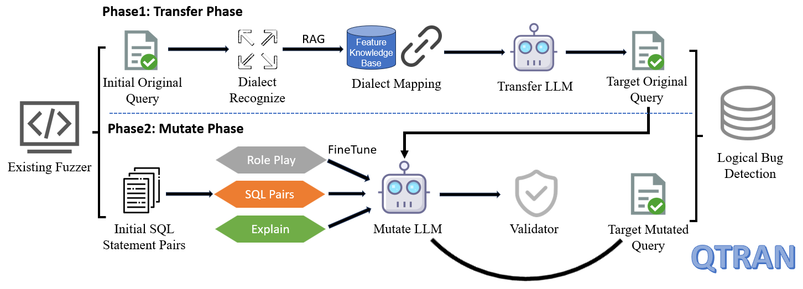
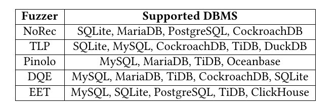

## Overview

### Preparation
这部分为预搭建的部分，且后续可不断更新
1. Feature Knowledge Base Establishing
* Crawler ([Feature Knowledge Base_MySQL](SQLancer_Experiments/sqlancer_experimemt1))：获取文档
* Feature Knowledge Base Preprocessing 
	* Refine or Generate Examples for Features([[Refine or Generate Examples for Features]])：为所有feature提取/生成examples
2. RAG-based Feature Mapping([[RAG-based Feature Mapping]])：基于RAG实现所有db之间的feature mapping 
### Transfer Phase
这部分进行initial original query的transfer，得到target original query
1. Dialect Recognize([[Dialect (Feature) Recognize]])：识别query中的Potential Features和Potential Dialect Features
2. Transfer LLM without Feature Knowledge ([[Overview_Transfer LLM without Feature Knowledge]])：无feature knowledge，只做few-shot，error-iteration
3. Transfer LLM with Feature Knowledge ([[Overview_Tranfer LLM with Feature Knowledge]])：将query中被识别为Potential Dialect Features的feature knowledge作为背景知识添加到transfer prompt中，辅助transfer
### Mutate Parse
1. Fine-Tuning of the Mutate LLM：为所支持的工具微调出对应的mutate llm
2. Mutate LLM：使用微调好的mutate llm进行Target Mutated Query的mutate

## Testing DBMS
为了排除同名（主要是operator的同名现象；函数的同名现象也存在，但参数一定是不一样的，函数名带具体参数并不方便）的影响，为每个文件名称前面加上前缀编号
* MySQL(function,op,statement)：已拉取成功
* TiDB(function,op,statement)
* MariaDB(function,op,statement, statement似乎有部分问题)
* OceanBase(function,op,statement)
* SQLite(function,op)
* PostgreSQL(function,op)
* CockroachDB(statements的语法部分以语法图的形式展示，无法以代码形式获取)
* Virtuoso(官网文档的描述难以形容，function的内容近乎没有)
* MonetDB(function,op)
* DuckDB(function,op,statement的语法是语法图格式,无法获取)
* ClickHouse(function,op)

| Fuzzer       | Supported DBMS                              | Extendted                                              |
| ------------ | ------------------------------------------- | ------------------------------------------------------ |
| NoRec        | SQLite, MariaDB, PostgreSQL,                | MySQL, TiDB, MonetDB, DuckDB, ClickHouse, (OceanBase)  |
| TLP          | SQLite, MySQL, TiDB, DuckDB                 | MariaDB, PostgresSQL, (OceanBase), MonetDB, ClickHouse |
| Pinolo       | MySQL, MariaDB, TiDB, (Oceanbase)           | SQLite, PostgresSQL, MonetDB, DuckDB , ClickHouse      |
| DQE          | MariaDB, MySQL, TiDB, SQLite, (CockroachDB) | PostgresSQL, MonetDB, DuckDB, ClickHouse(OceanBase)    |
| EET（过长，quit） | MySQL, SQLite, PostgreSQL, TiDB, ClickHouse | MariaDB,(OceanBase), MonetDB, DuckDB                   |
|              |                                             |                                                        |
![[90cc4d1cce1ed1fede9b0fb35cc191b8_.png]]
norec, dqe

## Baselines
Pinolo、SQLancer
## Metrics
Bug detection efficiency、Diversity、Correctness、 Coverage

## RQ1 有效性

![[Pasted image 20241025160724.png]]
![[3f7333d9dceffcb60d8134efef719ee.png]]
* statements：3小时，测了多少条数数据：在sqlancer测得每一条数据中加上transfer开始和结束时间，mutate开始和结束时间
* valid：不仅语法正确可执行，而且mutate满足Oracle（注：不满足的进行人工bug确认）
* 崩溃：测得时候遇到数据库崩的情况就记录一下，只在需要重启docker的时候记录即可

