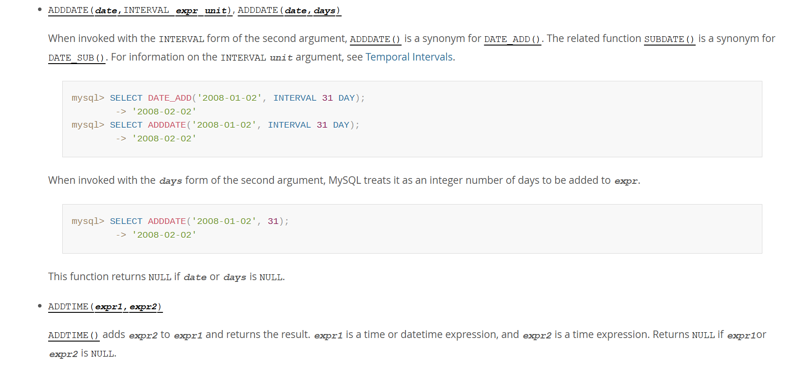
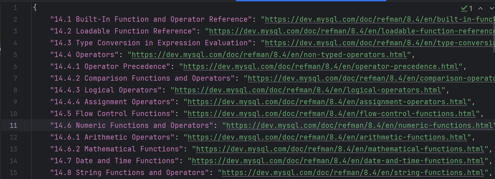
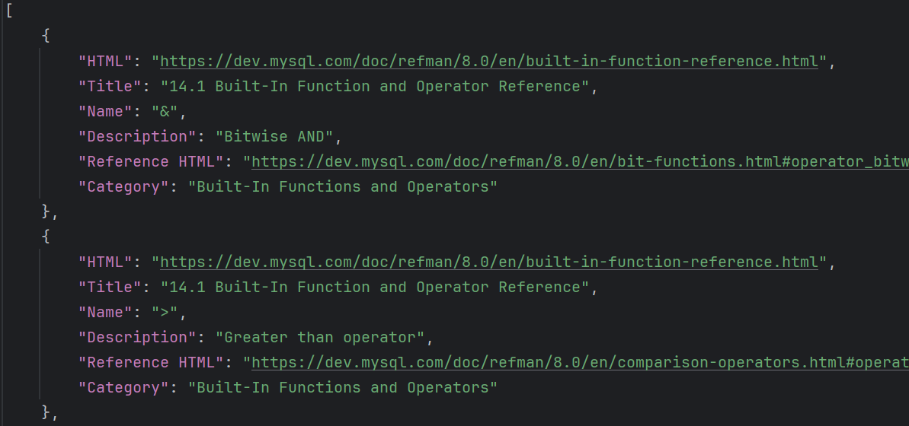
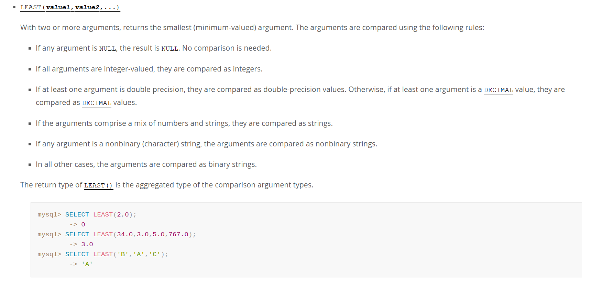

# Functions and Operators

## Functions and Operators文档相关链接
[MySQL :: MySQL 8.0 Reference Manual :: 14 Functions and Operators](https://dev.mysql.com/doc/refman/8.0/en/functions.html)
## Functions and Operators文档元素解释
### MySQL官网Fucntions and Operators目录
```
Table of Contents
14.1 Built-In Function and Operator Reference
14.2 Loadable Function Reference
14.3 Type Conversion in Expression Evaluation
14.4 Operators
14.4.1 Operator Precedence
14.4.2 Comparison Functions and Operators
14.4.3 Logical Operators
14.4.4 Assignment Operators
14.5 Flow Control Functions
14.6 Numeric Functions and Operators
14.7 Date and Time Functions
14.8 String Functions and Operators
14.9 Full-Text Search Functions
14.10 Cast Functions and Operators
14.11 XML Functions
14.12 Bit Functions and Operators
14.13 Encryption and Compression Functions
14.14 Locking Functions
14.15 Information Functions
14.16 Spatial Analysis Functions
14.17 JSON Functions
14.18 Replication Functions
14.19 Aggregate Functions
14.20 Window Functions
14.21 Performance Schema Functions
14.22 Internal Functions
14.23 Miscellaneous Functions
14.24 Precision Math
```
### MySQL官网Fucntions and Operators目录解释

* 14.1，14.2分别枚举了Built-In Function and Operator，Loadable Function，网页页面包括feature（Name），Description以及对应的链接


* feature的详细信息如下
  
  
## 爬取Functions and Operators
### 数据结构
1. HTMLs.json: 各类别feature的全部网页的htmls，包括网页的标题和对应的html
``` JSON
{  
    "14.1 Built-In Function and Operator Reference": "https://dev.mysql.com/doc/refman/8.0/en/built-in-function-reference.html",  
    "14.2 Loadable Function Reference": "https://dev.mysql.com/doc/refman/8.0/en/loadable-function-reference.html"
}
```
2. Reference table: 所有reference table的内容，记录了单独feature的Name，对应的html以及对应的Category。
``` JSON
[
   {  
    "HTML": "https://dev.mysql.com/doc/refman/8.0/en/regexp.html",  
    "Title": "14.8.2 Regular Expressions",  
    "Name": "NOT REGEXP",  
    "Description": "Negation of REGEXP",  
    "Reference HTML":
    "https://dev.mysql.com/doc/refman/8.0/en/regexp.html#operator_not-regexp",  
    "Category": "String Functions and Operators"  
    }
]
```
3. Results：所有feature的详细信息，主要包括以下元素，Description，Feature，Examples，Category。
``` JSON
{  
    "HTML": [],  
    "Title": [  ],  
    "Name": "ACOS()",  
    "Description": [  ],  
    "Reference HTML": "https://dev.mysql.com/doc/refman/8.0/en/mathematical-functions.html#function_acos",  
    "Feature": [],  
    "Examples": [],  
    "Category": []  
}
```


### 爬取过程
#### 爬取Functions and Operators的html
* 收集嵌套目录的name和html

#### 爬取Reference table
* 收集functions/operators的Name，Description和Reference html


#### 爬取Functions/Operators信息
* 获取所有functions/operators的具体信息，包括完整的feature，description和exampls



