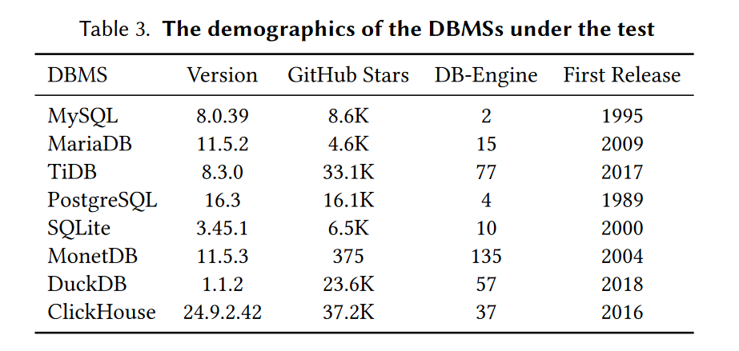

# QTRAN: Extending Metamorphic-Oracle based Logical Bug Detection Techniques for Multiple-DBMS Dialect Support

## ABSTRACT
QTRAN mitigates the dependence existing of MOLTs(Metamorphic-Oracle based Logic Bug Detection Techinique) on specific DBMS grammars and enhances their extension capabilities to new DBMSs,which can significantly improve the reliability and testing robustness of diverse DBMSs. 

QTRAN is a novel LLM-powered approach that automatically extends existing MOLTs to various DBMSs. QTRAN ensures that most of transferred SQL statement pairs are suitable for metamorphic testing and discovered 24 previously unknown logical bugs, 16 of which have been confirmed.  

The workflow encompasses two key phases: transfer phase and mutation phase.
## Prerequisites
### Databases
Before running, ensure that the databases supported by QTRAN  have been built and configured correctly.You can follow **the instructions in [Docker_Databases](Docker_Databases.md) (mainly using Docker containers)** to build the databases, or you can build them yourself. 
**Please note: that:**
1. After the databases are successfully built, **remember to fill in the correct database configuration information into the file [database_connector_args.json](src/Tools/DatabaseConnect/database_connector_args.json)** to successfully run QTRAN.
2. The detailed information of databases supported by QTRAN is in the table below. It is recommended to deploy the following version of the databases for optimal performance.

### LLM keys
Before running QTRAN, please make sure you have **valid large model API keys** so that QTRAN can successfully call the large model during execution.

