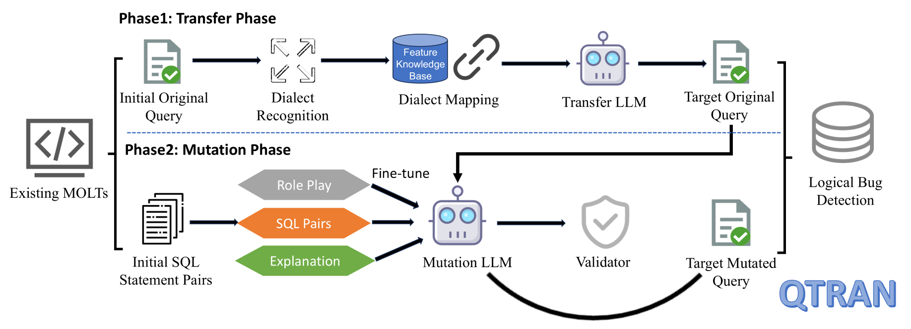

# QTRAN: Extending Metamorphic-Oracle based Logical Bug Detection Techniques for Multiple-DBMS Dialect Support

## Abstract
QTRAN mitigates the dependence existing of MOLTs(Metamorphic-Oracle based Logic Bug Detection Techinique) on specific DBMS grammars and enhances their extension capabilities to new DBMSs,which can significantly improve the reliability and testing robustness of diverse DBMSs. 

QTRAN is a novel LLM-powered approach that automatically extends existing MOLTs to various DBMSs. QTRAN ensures that most of transferred SQL statement pairs are suitable for metamorphic testing and discovered 24 previously unknown logical bugs, 16 of which have been confirmed.  

The workflow encompasses two key phases: transfer phase and mutation phase.
## Prerequisites
### Databases
Before running, ensure that the databases supported by QTRAN  have been built and configured correctly.You can follow **the instructions in [Docker_Databases](Docker_Databases.md) (mainly using Docker containers)** to build the databases, or you can build them yourself. 
**Please note: that:**
1. After the databases are successfully built, **remember to fill in the correct database configuration information into the file [database_connector_args.json](src/Tools/DatabaseConnect/database_connector_args.json)** to successfully run QTRAN.
2. The detailed information of databases supported by QTRAN is in the table below. It is recommended to deploy the following version of the databases for optimal performance.

3. The database **sqlite** doesn't requiring building.Because almost all versions of Linux operating systems come with SQLite pre-installed, we can directly use the system's built-in version without additional building.

### LLM keys
Before running QTRAN, please make sure you have **valid large model API keys** so that QTRAN can successfully call the large model during execution.

## Main Process

QTRAN decompose the analysis into two phases: the transfer and mutation phases. As shown in the picture of QTRAN's workflow, it starts with SQL statement pairs from existing MOLTs and extends these pairs to new DBMSs through the two phases.

### Transfer Phase
During the transfer phase, we start by identifying specific dialect features such as function names from the original queries using error recovery mechanisms. These identified features are then mapped to their equivalents in the target DBMS using a previously established feature knowledge base with the help of RAG. The enriched information and the original queries are then fed into the Transfer LLM, which adapts these queries to the syntax of the target DBMS, ensuring accurate translation and semantic correctness.

### Mutation Phase
In the mutation phase, we collect SQL statement pairs from existing MOLTs and enrich these pairs with role information and explanations of metamorphic mechanisms to fine-tune a mutation LLM. This tailored LLM is then used to mutate the original queries to fulfill metamorphic relationships, crucial for detecting logical bugs effectively. Additionally, we incorporate a validator to assess the effectiveness of the mutation LLM, ensuring that the mutated queries maintain their correctness and accurately reflect the intended logical transformations.